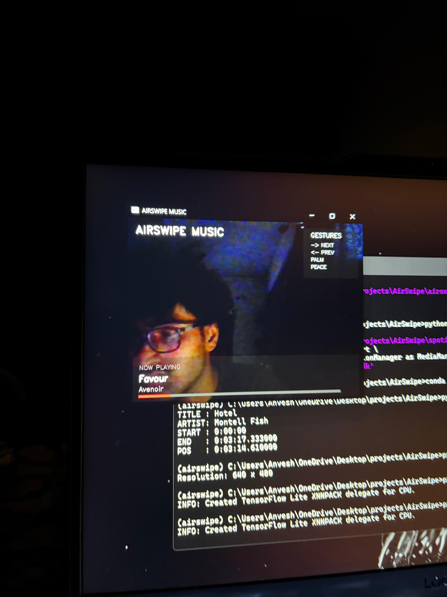
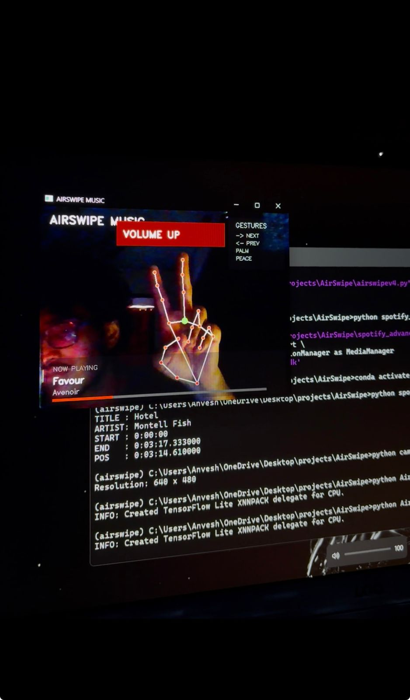
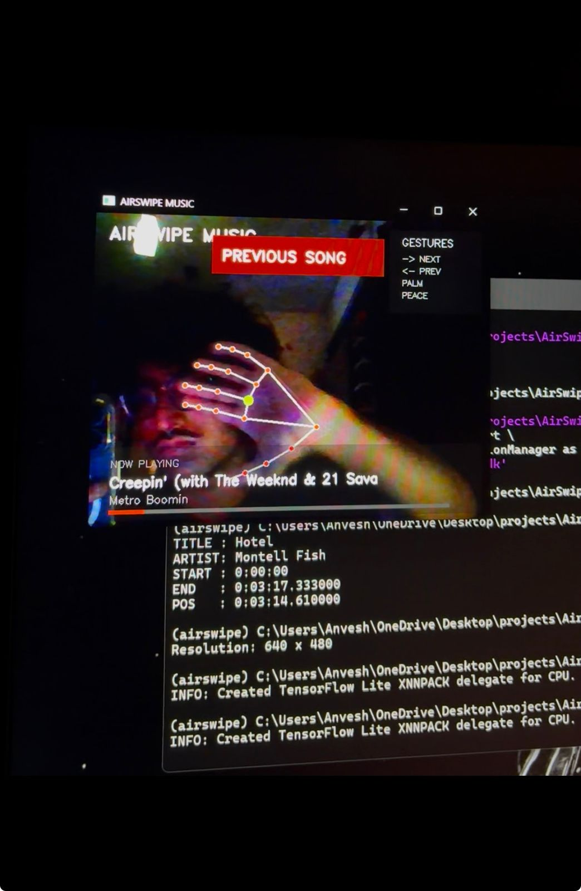
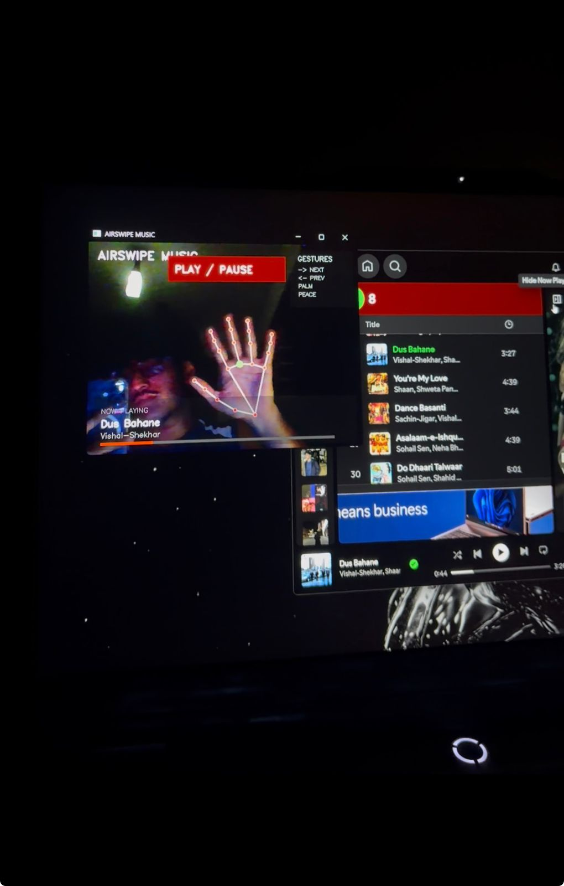

# 🎵 AirSwipe Music

A computer vision-based gesture-controlled music system that enables users to control media playback through hand gestures captured by a webcam.

Built using Python, OpenCV, and MediaPipe, AirSwipe Music translates hand movements into media commands in real time, providing a touchless and intuitive user experience.

---

## Features

* Real-time hand gesture recognition using MediaPipe
* Gesture-based music playback control
* Play/Pause, Next Track, Previous Track, and Volume Control
* Live Spotify song and artist display
* Real-time playback progress tracking
* Integrated user interface with gesture feedback
* Structured development history across multiple versions
* Application of Computer Vision and Human-Computer Interaction concepts

---

## Gesture Controls

| Gesture                   | Action             |
| ------------------------- | ------------------ |
| ✋ Open Palm (hold)        | Play / Pause Music |
| 🫱 Swipe Right            | Next Track         |
| 🫱 Swipe Left             | Previous Track     |
| ✌️ Peace Sign + Move Up   | Volume Up          |
| ✌️ Peace Sign + Move Down | Volume Down        |

---

## 📸 Screenshots

### Main Interface



### ✌️ Volume Up Gesture



### 👈 Previous Song Gesture



### ✋ Play / Pause Gesture



---

## Development Journey

### V1 – Hand Tracking Foundation

* Real-time hand detection using MediaPipe
* Webcam-based gesture tracking

### V2 – Swipe Gesture Controls

* Swipe Right for next track navigation
* Swipe Left for previous track navigation

### V3 – Media Playback Control

* Open Palm gesture detection
* Play/Pause functionality
* Gesture cooldown system for improved stability

### V4 – Volume Control

* Peace Sign gesture recognition
* Volume increase control
* Volume decrease control

### V5 – Final Release

* Complete gesture-controlled music system
* Integrated user interface
* Live Spotify integration
* Real-time song and artist display
* Playback progress tracking
* Gesture feedback notifications
* Improved usability and visual presentation
* Enhanced project organization and maintainability

---

## Technologies Used

* Python
* OpenCV
* MediaPipe
* PyAutoGUI
* WinSDK
* NumPy

---

## Project Structure

```text
AirSwipe-Music/
│
├── README.md
├── Requirements.txt
│
├── Versions/
│   ├── airswipev1.py
│   ├── airswipev2.py
│   ├── airswipev3_stable.py
│   ├── airswipev4.py
│   └── airswipe_v5_final.py
│
└── Experiments/
    ├── spotify_test.py
    ├── spotify_live_test.py
    ├── spotify_advanced_test.py
    └── camera_test.py
```

---

## Installation

Clone the repository:

```bash
git clone https://github.com/anveshhx/AirSwipe-Music.git
cd AirSwipe-Music
```

Install dependencies:

```bash
pip install -r Requirements.txt
```

Run the final version:

```bash
python Versions/airswipe_v5_final.py
```

---

## Future Improvements

* Album artwork integration
* Customizable gesture mappings
* Multi-hand support
* Additional interface themes
* Gesture analytics and usage insights
* Cross-platform compatibility
* Adaptive gesture calibration

---

## Demo

Project demonstrations showcase:

* Real-time hand tracking
* Gesture-based media control
* Spotify integration
* Integrated user interface
* Playback progress tracking

---

## Author

**Anvesh**

Computer Vision • Python • Artificial Intelligence

Developed as an exploration of gesture recognition, human-computer interaction, real-time media control, and practical computer vision applications.
